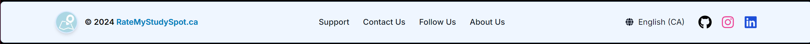

Author
This component was written by Dricmoy Bhattacharjee.

| Prop               | Type     | Description                                                                | Default                |
|--------------------|----------|----------------------------------------------------------------------------|------------------------|
| `RateMyStudySpot`  | Object   | Contains URLs for social media links and logo image.                       | Required               |
| `bgFooter`         | string   | Tailwind classes to set the background styling of the footer.              | `bg-gray-100 rounded-lg p-2` |
| `footerLink`       | string   | Tailwind classes for link text color.                                      | `text-gray-800`        |
| `onLinkHover`      | string   | Tailwind classes for hover effects on links.                              | `hover:text-sky-700 hover:scale-110` |
| `dateText`         | string   | Tailwind classes for the date text color.                                  | `text-black`           |
| `logoText`         | string   | Tailwind classes for the logo text styling, including gradient effects.    | `text-transparent bg-clip-text bg-gradient-to-r from-sky-500 to-sky-300` |

// Light footer
    <Footer
    RateMyStudySpot={rateMyStudySpot}
    bgFooter="bg-blue-50 border border-blue-200 rounded-md p-4"
    footerLink="text-gray-900"
    onLinkHover="transition-all duration-300 ease-in-out hover:text-sky-600 hover:scale-105"
    dateText="text-black"
    logoText="relative text-transparent bg-clip-text bg-black hover:text-sky-600 hover:scale-105"
    />
 

// Dark footer
<Footer
  RateMyStudySpot={rateMyStudySpot}
  bgFooter="bg-gray-900 p-5 rounded-md border border-gray-800 shadow-md"
  footerLink="text-gray-300"
  onLinkHover="transition-all ease-in-out duration-300 hover:text-blue-500 hover:scale-110"
  dateText="text-gray-400"
  logoText="text-white font-bold hover:text-sky-500 transition duration-300"
/>


// Diagonal Box Layout
<Footer
  RateMyStudySpot={rateMyStudySpot}
  bgFooter="bg-white p-6 rounded-lg shadow-md relative overflow-hidden before:absolute before:top-0 before:right-80 before:w-[150%] before:h-full before:bg-gradient-to-br before:from-purple-300 before:to-sky-500 before:opacity-20 before:skew-y-6 before:transform before:translate-x-8"
  footerLink="text-gray-800"
  onLinkHover="hover:text-blue-500 hover:scale-105 transition"
  dateText="text-gray-600"
  logoText="text-gray-900 font-semibold"
/>

    
Example Usage: 
```javascript
import Footer from "../components/footer/Footer";

export default function Home() {
  const rateMyStudySpot = {
    instagram: "https://instagram.com/yourprofile",
    discord: "https://discord.gg/yourinvite",
    github: "https://github.com/yourprofile",
    logo: "/logo192.png",
  };

  return (
    <main className="relative flex min-h-screen items-center justify-center overflow-x-hidden">
      <Footer
        RateMyStudySpot={rateMyStudySpot}
        bgFooter="bg-blue-50 border border-blue-200 rounded-md p-4"
        footerLink="text-gray-900"
        onLinkHover="transition-all duration-300 ease-in-out hover:text-sky-600 hover:scale-105"
        dateText="text-black"
        logoText="relative text-transparent bg-clip-text bg-black hover:text-sky-600 hover:scale-105"
      />
    </main>
  );
}

